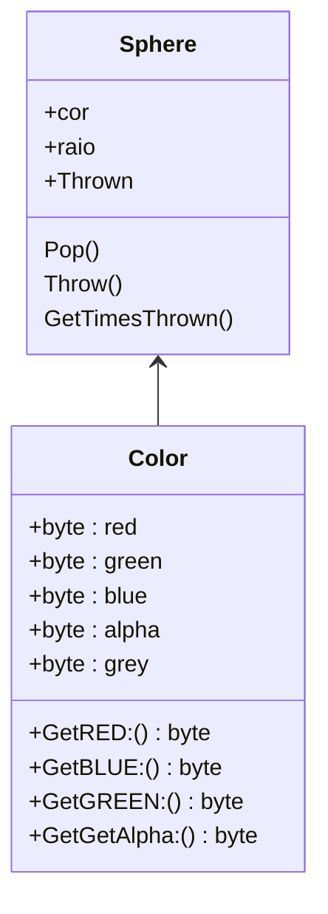

## Mermaid Diagram

```mermaid
classDiagram

class Color{
    +byte : red
    +byte : green
    +byte : blue
    +byte : alpha
    +byte : grey 
    +GetRED:() byte
    +GetBLUE:() byte
    +GetGREEN:() byte
    +GetGetAlpha:() byte

}
Sphere <--Color

class Sphere{
    +cor
    +raio
    +Thrown
    Pop()
    Throw()
    GetTimesThrown()

}


    


```